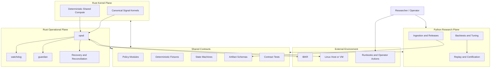

# Backtesting_Engine

Backtesting_Engine is an early-stage research and operations program for making honest promotion decisions about gold futures strategies and then operating approved strategies safely in paper, shadow-live, and live trading.

The repository is currently a planning-and-contract scaffold. The detailed program design lives in [Plan_1.md](/home/ubuntu/ntm_Dev/Backtesting_Engine/Plan_1.md), and beads in `.beads/issues.jsonl` are the task system of record.

## Mission

The program exists to answer six questions before capital is trusted:

1. Which strategy families deserve budget?
2. Which parameter regions are stable enough to validate?
3. Which candidates survive realistic fills, null comparisons, robustness tests, omission tests, and a frozen final holdout?
4. If research is done on MGC but live execution is on 1OZ, has portability and execution-symbol tradability been explicitly certified rather than assumed?
5. Can the exact frozen candidate be replayed through the operational stack without research/live drift, including data-profile, contract-state, and signal-kernel parity?
6. Can the candidate survive paper trading, shadow-live, account-fit, session resets, broker reconciliation, and solo-operator operational risk on the live contract?

The platform is not allowed to optimize for attractive backtests at the expense of deployability.

## Initial Live-Lane Posture

The first approved lane is intentionally narrow:

- Historical research is centered on `MGC`.
- Paper, shadow-live, and live execution are centered on `1OZ`.
- Live market data and execution are both `IBKR` in v1.
- The approved live account posture is capped at `$5,000` with a maximum of one live `1OZ` contract.
- Live-eligible strategies must be bar-based with decision intervals of one minute or slower.
- Depth-dependent, queue-dependent, and sub-minute strategies are research-only.
- The default live posture is one active live bundle per account/product.
- The first production deployment targets one Linux host or VM.
- Overnight holding is permitted only as a stricter candidate class with additional gates.

## Planned Architecture

The target architecture is a hybrid Python/Rust monorepo with strict plane separation:

- Python research plane for ingestion, releases, backtests, tuning, replay certification, and reporting.
- Rust kernel plane for canonical live-eligible signal kernels and deterministic shared compute.
- Rust operational plane for `opsd`, broker integration, risk enforcement, recovery, and reconciliation.
- Shared contracts for schemas, policy bundles, state machines, fixtures, and compatibility rules.

One early scaffolded contract for this repo lives at:

- `shared/policy/charter/initial_live_lane.json`
- `shared/fixtures/charter/initial_live_lane_cases.json`
- `python/research/charter/posture.py`
- `tests/test_initial_live_lane.py`

These artifacts encode the initial live-lane posture as machine-readable assertions with executable checks and structured decision traces.

Since then, the repository has expanded into a much broader contract surface covering releases, portability, execution-symbol tradability, replay and parity certification, promotion packets, readiness state machines, runtime recovery, accounting-ledger close, Rust runtime smokes, and operator runbooks.

## Why This Is Useful

Many trading repositories answer only one question: "did the backtest look attractive?" This repository is aimed at a harder and more useful question: "can this exact candidate be trusted, reproduced, promoted, operated, recovered, and audited without hidden assumptions?"

That changes what gets built. Instead of treating research, deployment, and operations as separate concerns, the program binds them together with explicit artifacts and contract checks. A candidate is not considered valuable just because it has a promising historical equity curve. It must also survive realistic execution assumptions, portability checks, replay checks, account-fit constraints, session readiness checks, reconciliation, and failure drills.

The practical benefit is that obvious sources of self-deception are forced into the open early:

- a strategy that only works on one research contract but not the live execution contract
- a candidate that looks good with idealized fills but collapses under realistic execution assumptions
- a runtime that cannot explain why it is safe to trade right now
- an operator workflow that has no durable evidence for what happened, why it happened, and how to recover

## What Has Been Built So Far

The repository is still early-stage, but it is no longer just a thin placeholder. It now contains a contract-first spine that covers a large part of the intended lifecycle:

- `shared/policy/` contains the machine-readable policy, artifact, and state-machine contracts for research, promotion, readiness, runtime operation, and recovery.
- `shared/fixtures/` contains deterministic case data that exercises those contracts without relying on prose-only interpretation.
- `tests/` and `tests/contracts/` execute the shared surfaces directly and check that serialized artifacts round-trip cleanly and fail closed on malformed input.
- `python/research/` contains the early Python-side policy and research-plane surfaces.
- `python/bindings/` contains the Python bridge to canonical Rust kernel behavior and certification checks.
- `rust/kernels/` contains the canonical Rust signal-kernel plane and replay-oriented kernel artifacts.
- `rust/opsd/` contains the operational runtime spine: readiness, risk, recovery, reconciliation, evidence archiving, route-mode control, and end-to-end smoke binaries.
- `rust/watchdog/` and `rust/guardian/` hold supervisory and emergency-response runtime surfaces.
- `scripts/` contains executable smoke drivers that validate vertical slices of the system from contract payloads through runtime-style behavior.
- `docs/runbooks/` contains operator-facing recovery, startup, reconciliation, and escalation guidance aligned with the runtime surfaces.

## Architecture Graph

## End-to-End Promotion Flow

At a high level, the program is trying to freeze an honest, reproducible path from research to live operation:

1. Research starts with historical ingestion, normalized data, and explicit release artifacts.
2. Strategy families and parameter regions are filtered through governance and hard-gate surfaces before expensive validation work is trusted.
3. Candidates are evaluated under realistic execution assumptions, not just idealized bar-level outcomes.
4. If research and live execution differ, portability and execution-symbol tradability must be certified explicitly.
5. The exact candidate is frozen into a candidate bundle with dependency pins and replayable artifact references.
6. Promotion packets and preflight checks bind the candidate to the approved account, fee, margin, entitlement, and policy context.
7. Session readiness packets answer whether the deployment is safe to operate for the current session window.
8. Session tradeability and runtime control surfaces answer whether new entries are allowed right now.
9. Runtime recovery, reconciliation, and accounting-ledger close surfaces preserve evidence that the operational lane remained coherent.
10. Revocation, suspension, or closure can happen when evidence degrades, compatibility breaks, or runtime conditions drift outside the certified envelope.

## Core Artifact Model

The repository uses explicit artifacts as the connective tissue between planes. The important idea is that research conclusions, runtime permissions, and operator actions should reference durable objects instead of relying on ambient context.

- `dataset release`: the certified historical dataset boundary used for research and replay.
- `data-profile release`: the interpretation layer over market data semantics.
- `analytic release`: derived analytics tied to exactly one dataset release.
- `execution profile release`: the frozen execution-assumption model used for realistic validation.
- `resolved context bundle`: the point-in-time dependency bundle for sessions, calendars, rolls, masks, and pinned reference state.
- `candidate bundle`: the frozen research candidate and its required dependencies.
- `bundle readiness record`: the certified record that a candidate is allowed to advance toward deployment.
- `promotion packet`: the signed package that binds a frozen candidate to a lane, account posture, evidence set, and policy bundle.
- `promotion preflight request`: the last-mile operational proof that the packet is resolved, compatible, and infrastructure-ready.
- `session readiness packet`: the per-session proof that the deployment remains safe to operate now.
- `session tradeability request`: the gate that decides whether new entries are allowed in the active session.
- `ledger close artifact`: the append-only reconciliation result between booked events and broker-authoritative state.

## Design Principles

- Contract-first development: critical behaviors are specified as explicit dataclasses, enums, fixtures, and tests before they are treated as trusted system behavior.
- Fail-closed boundaries: malformed serialized input should be rejected explicitly, not silently coerced into plausible-looking objects.
- Immutable promotion artifacts: the candidate that gets promoted should be the same candidate that gets replayed, rehearsed, and operated.
- Explicit compatibility domains: data protocol, strategy protocol, ops protocol, policy bundle hash, and matrix version are treated as named compatibility surfaces, not implicit assumptions.
- Plane separation: research logic, kernel logic, and operational logic are deliberately separated so hidden cross-plane coupling is easier to detect.
- Operational evidence over intuition: paper passes, shadow passes, recovery drills, reconciliation outputs, and runbook steps are part of the trust model.
- Narrow first lane: the repo intentionally starts with a constrained `MGC` research and `1OZ` live lane rather than pretending the whole strategy space is equally mature.

## Key Algorithms and Contract Families

The repository is not centered on one large monolithic algorithm. It is a collection of interacting decision surfaces, each built to eliminate a common failure mode.

- Research governance and discovery accounting: decide which families deserve attention and which expansions require explicit continuation approval.
- Execution realism and calibration: model realistic fills, latency, slippage, quote absence, spread spikes, and degraded bars instead of trusting idealized execution.
- Portability and tradability: certify that a candidate researched on one contract can be promoted safely to a different execution contract.
- Replay and parity certification: verify that the frozen candidate can be reproduced through the runtime stack without research/live drift.
- Session-conditioned risk and account fit: bind live-eligible candidates to the specific account posture, fee schedule, margin context, and session envelope they were approved for.
- Deployment and readiness state machines: represent promotion, activation, session readiness, tradeability, withdrawal, and closure as explicit transitions rather than loose flags.
- Append-only ledger close and reconciliation: preserve a durable distinction between booked state, broker-authoritative state, and reconciliation adjustments.
- Failure drills and runtime recovery: ensure the system can recover in a controlled and auditable way, not merely run when conditions are perfect.

## Repository Map

For a new reader, these are the most important directories:

- `shared/policy/`: the canonical contract surface for most business rules and state transitions.
- `shared/fixtures/`: deterministic case data for policy and runtime surfaces.
- `tests/`: executable coverage over the shared contracts and smoke harnesses.
- `python/research/`: early research-plane policy and charter logic.
- `python/bindings/`: Python-to-Rust binding and certification surfaces.
- `rust/kernels/`: canonical signal-kernel and replay-oriented Rust code.
- `rust/opsd/`: operational runtime services and smoke binaries.
- `rust/watchdog/`: supervision and health-check services.
- `rust/guardian/`: emergency-action and protective-control surfaces.
- `scripts/`: executable smoke drivers for contract and runtime slices.
- `docs/runbooks/`: operator procedures for startup, review, reconciliation, incident handling, and recovery.

## How To Read The Repo

If you are trying to understand the system quickly, a good reading order is:

1. Read this README to understand the problem framing and the lane constraints.
2. Read `Plan_1.md` to understand the intended long-form program design.
3. Read a few representative modules in `shared/policy/` such as `release_schemas.py`, `resolved_context.py`, `deployment_packets.py`, `runtime_recovery.py`, and `accounting_ledger.py`.
4. Read the matching tests in `tests/` to see the intended contract behavior and failure modes.
5. Read the Rust `opsd` modules and smoke binaries to see how the operational plane is being made executable.
6. Read the runbooks in `docs/runbooks/` to see how the operator-facing story is supposed to line up with the technical contracts.

## Current State

The repository should still be understood as contract-first and scaffold-heavy, but it is increasingly executable.

Today, many of the most important policy surfaces already exist as code, fixtures, tests, smoke scripts, and Rust runtime modules. What is still incomplete is not the existence of those boundaries, but the final consolidation into a fully integrated production-grade trading stack. That distinction matters: the repo is already useful for making hidden assumptions explicit, validating serialized boundaries, and rehearsing runtime logic, even where the final operational assembly is still evolving.
